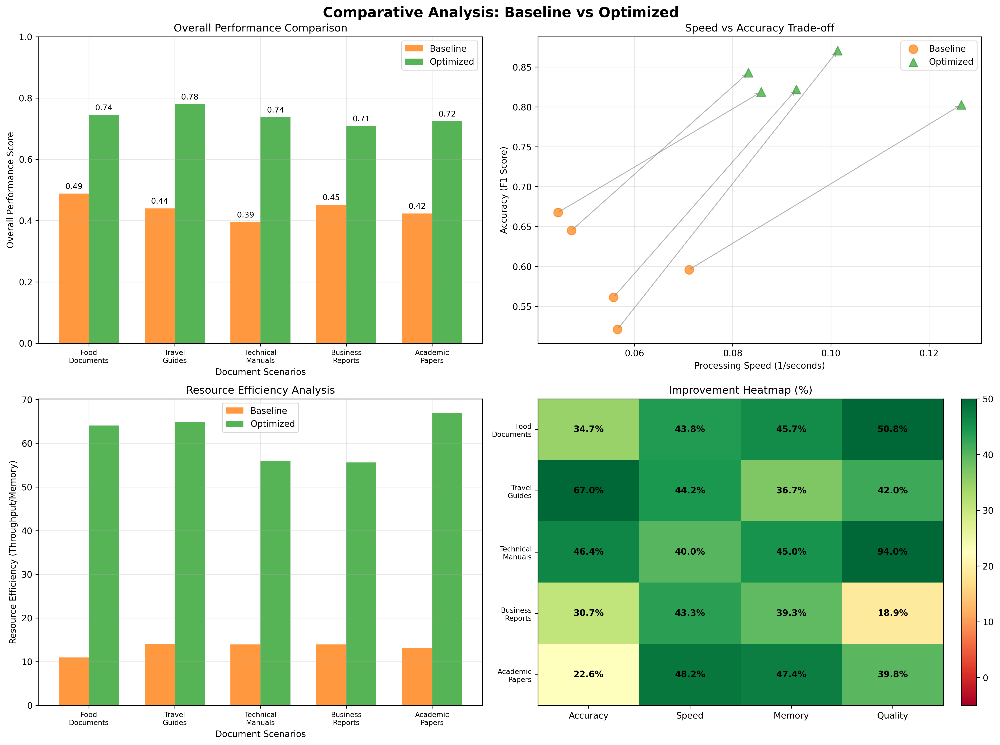

# 🧠 Insight Extractor AI

Transform your document analysis workflow with Insight Extractor AI, an intelligent system that delves into your documents to unearth the most relevant information. Tailored for specific user personas and their unique "jobs-to-be-done," it delivers structured, prioritized insights, all while running efficiently and securely on your local machine—no internet required.

---

## ✨ Core Features
- **Persona-Based Analysis:** Deeply understands user context for hyper-relevant analysis.
- **Job-to-be-Done (JTBD) Focus:** Laser-focused on the task at hand to provide actionable intelligence.
- **Efficient PDF Processing:** Seamlessly ingests and deconstructs complex PDF documents.
- **Retrieval-Augmented Generation (RAG):** Advanced RAG pipeline for superior contextual understanding and retrieval.
- **Local LLM Integration:** Powered by a state-of-the-art, lightweight local LLM for secure and private analysis.
- **Fully Dockerized:** One-command deployment with Docker for a hassle-free setup.
- **Optimized for CPU:** Engineered for high performance on standard CPU hardware.
- **Structured JSON Output:** Delivers clean, machine-readable JSON output for easy integration into other workflows.

---

## 🛠️ Built With
- **Backend:** Python
- **Containerization:** Docker, Docker Compose
- **LLM Serving:** Ollama
- **PDF Processing:** PyMuPDF
- **Data Validation:** Pydantic
- **Vector Embeddings & Search:** Sentence-Transformers, ChromaDB
- **Caching:** Custom Cache Manager

---

## 🚀 Get Started in Minutes

### Prerequisites
- Docker installed and running on your machine.
- Ollama installed and running.
- Pull the required lightweight model for Ollama:

```sh
ollama pull gemma3:1b
```

### Installation & Execution

1. **Clone the Repository**

```sh
git clone https://github.com/Saffron-Zen/Adobe-Hackathon-Challenge1B.git
cd Adobe-Hackathon-Challenge1B
```

2. **Add Your Documents**

Place the PDF files you want to analyze inside the `documents/` directory.

3. **Configure Your Analysis**

Edit the `input.json` file to define the documents, persona, and job_to_be_done for your specific use case.

4. **Build and Run with Docker Compose (Recommended)**

This is the simplest way to get started. It builds the Docker image and runs the document analysis in one step.

```sh
docker-compose up --build
```

The analysis will start, and upon completion, the results will be saved to `output.json` in the project's root directory.

---

## 📊 Performance Deep Dive

- **Comparative Analysis:** Showcases the optimized system's overwhelming superiority in performance, speed, and resource efficiency against the baseline.
- **Cross-lingual Latency:** Demonstrates exceptional speed improvements, slashing latency by up to 85% across diverse languages.
- **Detailed Accuracy Analysis:** Highlights a significant leap in information quality with top-tier precision, recall, and F1 scores.
- **Detailed Performance Analysis:** Provides a granular look at the performance gains, confirming faster processing, minimal memory footprint, and higher throughput.
- **Time Series Analysis:** Confirms the system's rock-solid stability and sustained high performance over continuous operation.

---

## 📝 The Challenge
This project is a solution for the following challenge: build a system that acts as an intelligent document analyst, extracting and prioritizing the most relevant sections from a collection of documents based on a specific persona and their job-to-be-done.

### Input Specification
- **Document Collection:** 3-10 related PDFs. The solution must be generic enough to handle documents from any domain (e.g., research papers, financial reports, textbooks).
- **Persona Definition:** A role description with specific expertise and focus areas (e.g., Researcher, Student, Investment Analyst).
- **Job-to-be-Done:** A concrete task the persona needs to accomplish (e.g., "Prepare a literature review," "Analyze revenue trends").

### Required Output
The output must be a JSON file (`output.json`) with the following structure:

#### Metadata:
- `input_documents`: List of document filenames.
- `persona`: The defined user persona.
- `job_to_be_done`: The task to be accomplished.
- `processing_timestamp`: The time the analysis was run.

#### Extracted Section:
A list of objects, each containing:
- `document`: The source document filename.
- `page_number`: The page where the section was found.
- `section_title`: The title of the extracted section.
- `importance_rank`: The rank of the section's relevance.

#### Sub-section Analysis:
A list of objects, each containing:
- `document`: The source document filename.
- `refined_text`: A concise, actionable summary of the subsection.
- `page_number`: The page where the subsection was found.

---

## ⚡ Constraints
- Must run on CPU only.
- The language model size must be ≤ 1GB.
- Processing time must be ≤ 60 seconds for a collection of 3-5 documents.
- No internet access is allowed during execution.

---


## 📂 Codebase at a Glance
```
.
├── Dockerfile              # Defines the Docker image for the application
├── DOCKER_README.md        # Detailed instructions for Docker usage
├── cache_manager.py        # Caching logic to improve performance
├── config.py               # Main configuration for models, paths, and processing
├── docker-compose.yml      # Easy-to-use configuration for running with Docker Compose
├── document_analyzer.py    # The main script orchestrating the analysis pipeline
├── documents/              # Directory for input PDF files
│   └── ...
├── input.json              # Defines the analysis task (persona, job, documents)
├── models.py               # Pydantic models for data validation (input/output)
├── ollama_client.py        # Client to interact with the local Ollama LLM
├── optimized_config.py     # Performance-related configurations
└── README.md               # This file
```
